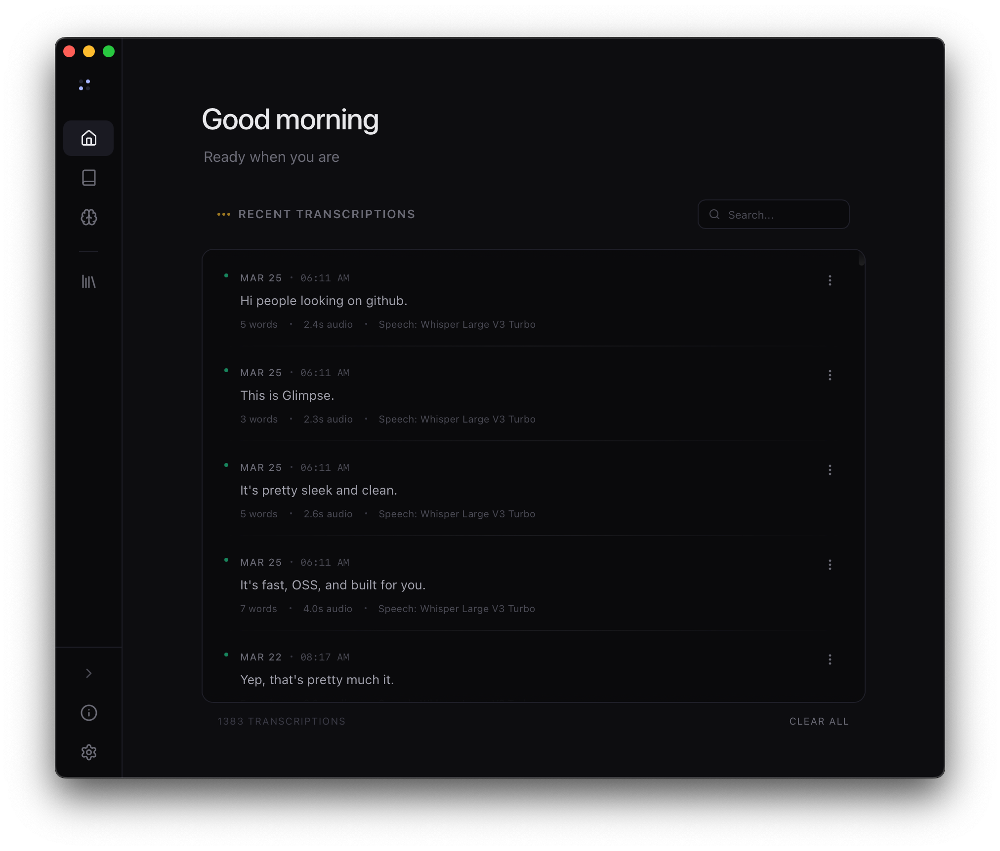
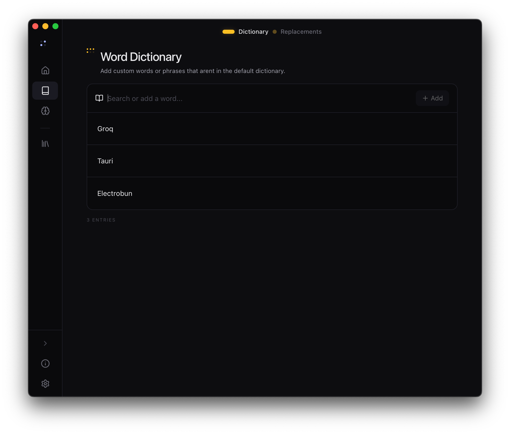
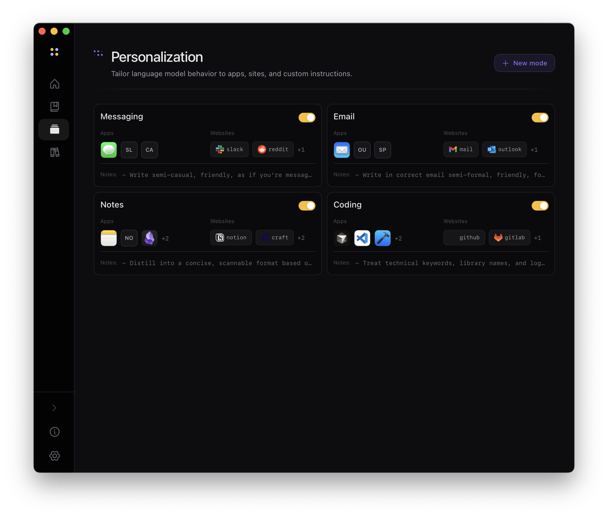
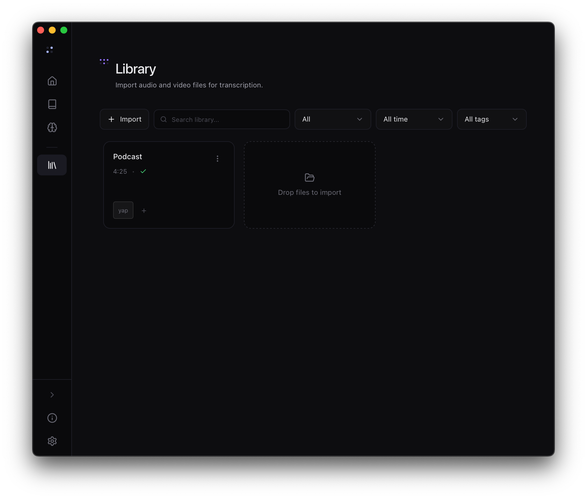

  <h1>Glimpse</h1>
  
Voice dictation that stays on your device. Open-source, local-first, and built for people who actually care about privacy.

  
  

    <a href="https://github.com/LegendarySpy/Glimpse/releases/latest">Download</a> ·
    <a href="https://tryglimpse.cc/">Website</a> ·
    <a href="#glimpse-personal">Pricing</a> ·
    <a href="#roadmap-10">Roadmap</a> ·
    <a href="https://tryglimpse.cc/privacy">Privacy</a>
  

  

    
    
    
  

---

Glimpse is a local-first voice dictation app. **Core dictation is free**, no subscription, no cloud required, and transcription runs on your device. Optional AI writing (cleanup, edit mode, personalization) uses your own LLM provider when you enable it.

Built as an open-source alternative to Superwhisper and WisprFlow, for people who left (or never started) because of pricing or privacy concerns.

## Screenshots

  
  

  
  

## Features

### Always free

- **Local transcription.** Unplug your wifi. It still works.
- **Custom dictionary.** Teach it *Tauri*, *Groq*, or your coworker's hard-to-spell last name.
- **Replacements.** Say *"my address"*, get `221B Baker Street`.
- **Auto Dictionary.** Glimpse automatically learns your custom words.
- **History & search.** Browse, search, and manage past dictations.

### Personal features

These features are included in a **14-day trial**, then require a one-time [Glimpse Personal](#glimpse-personal) license (no subscription):

- **Library.** Drop in an `.mp4`, scrub the synced transcript, export to `.srt`, `.txt`, or `.json`.
- **AI Cleanup:** polish dictated text with your LLM provider.
- **Edit mode:** highlight text, say *"make it less formal,"* and watch it rewrite in place.
- **Personalization:** set different tones per app or site, with [snippets](https://github.com/LegendarySpy/Glimpse/wiki/snippets) for dynamic context.
- **Local API:** OpenAI-compatible speech endpoint on your machine.
- **CLI:** optional `glimpse` command for terminal workflows.

Configure AI writing under **Settings → Providers**. Speech models live under **Settings → Models**.

## Glimpse Personal

Advanced features use **Glimpse Personal**, a one-time purchase, not a subscription. Core dictation stays free.

| Edition | Price | For |
| --- | --- | --- |
| **Personal** | $12.99 | You, on up to 5 personal devices |
| **Commercial** | $24.99 | Work use, on up to 5 seats |

- **14-day trial:** full Personal features without buying first.
- **Activate in-app:** buy or paste your license key from **Settings → Account**.

## Support

Questions, bugs, or feedback: [hello@tryglimpse.cc](mailto:hello@tryglimpse.cc) or GitHub Issues.

## Roadmap 1.0+

- [ ] Meeting mode
- [x] CLI
- [x] API
- [ ] Remote mode
- [ ] Cloud mode
- [ ] Library overhaul
- [x] BYOK STT
- [x] Import from other apps

## Contributing

Interested in helping out? Check the [Contributing Guide](CONTRIBUTING.md) for ways to get involved, from translations to code to bug reports.

## Privacy

Glimpse keeps core transcription on-device by default. Glimpse itself does **not** collect your transcriptions, audio, prompts, or API keys.

Glimpse collects **anonymous usage telemetry** via [PostHog EU](https://posthog.com/) to help prioritize development:

- **Collected:** app launches/exits, uptime, recording count, transcription engine and keybind mode, model downloads, onboarding completion
- **Never collected by Glimpse:** transcripts, audio, API keys, prompts, or any personally identifiable information

If you enable an external LLM provider under **Settings → Providers**, text for **Cleanup**, **Edit Mode**, and **Personalization** is sent directly to that provider when those features run. Your API key stays stored locally in Glimpse. Glimpse Personal is required to use those features after the trial.

Telemetry is tied to a random install ID (not your identity) and stored in the EU. You can **opt out** at any time in **Settings → App**. For complete transparency, see [`src-tauri/src/analytics.rs`](src-tauri/src/analytics.rs) and the [Glimpse Wiki](https://github.com/LegendarySpy/Glimpse/wiki/Analytics).

## License

**Source code:** Glimpse is licensed under [AGPL-3.0](LICENSE). If you distribute Glimpse or offer it as a network service, you must make the corresponding source, including your modifications, available under AGPL-3.0.

**Official app builds:** Core dictation is free. Advanced features (Library, AI writing, Edit Mode, Local API, CLI) require **Glimpse Personal** after the trial. See [Glimpse Personal](#glimpse-personal) above.

A hosted **cloud tier** (faster speeds, cloud-only features) is still planned for the future and is not part of 0.9.0.

## Acknowledgments

-  [Lokalise](https://lokalise.com/) (localization platform, OSS supporter)
- [Tauri](https://v2.tauri.app/) (app framework)
- [Glimpse-Speech](https://github.com/LegendarySpy/Glimpse-Speech) (MIT, local transcription engine)
- [whisper-rs](https://codeberg.org/tazz4843/whisper-rs) (Unlicense, Rust bindings for Whisper)
- [parakeet-rs](https://github.com/altunenes/parakeet-rs) (MIT OR Apache-2.0, ONNX Runtime bindings for Parakeet)

**Bundled speech models** (downloaded in-app from Hugging Face):
- Whisper GGML (MIT): `ggml-large-v3-turbo-q8_0.bin`, `ggml-small-q5_1.bin` via [`ggerganov/whisper.cpp`](https://huggingface.co/ggerganov/whisper.cpp)
- Parakeet TDT 0.6B v3 ONNX (CC-BY-4.0, all builds except Intel macOS): Int8 variant via [`istupakov/parakeet-tdt-0.6b-v3-onnx`](https://huggingface.co/istupakov/parakeet-tdt-0.6b-v3-onnx)
- Nemotron Streaming 0.6B Int8 (PolyForm Shield 1.0.0, all builds except Intel macOS): via [`lokkju/nemotron-speech-streaming-en-0.6b-int8`](https://huggingface.co/lokkju/nemotron-speech-streaming-en-0.6b-int8), with `encoder.onnx.data` from [`altunenes/parakeet-rs`](https://huggingface.co/altunenes/parakeet-rs)
