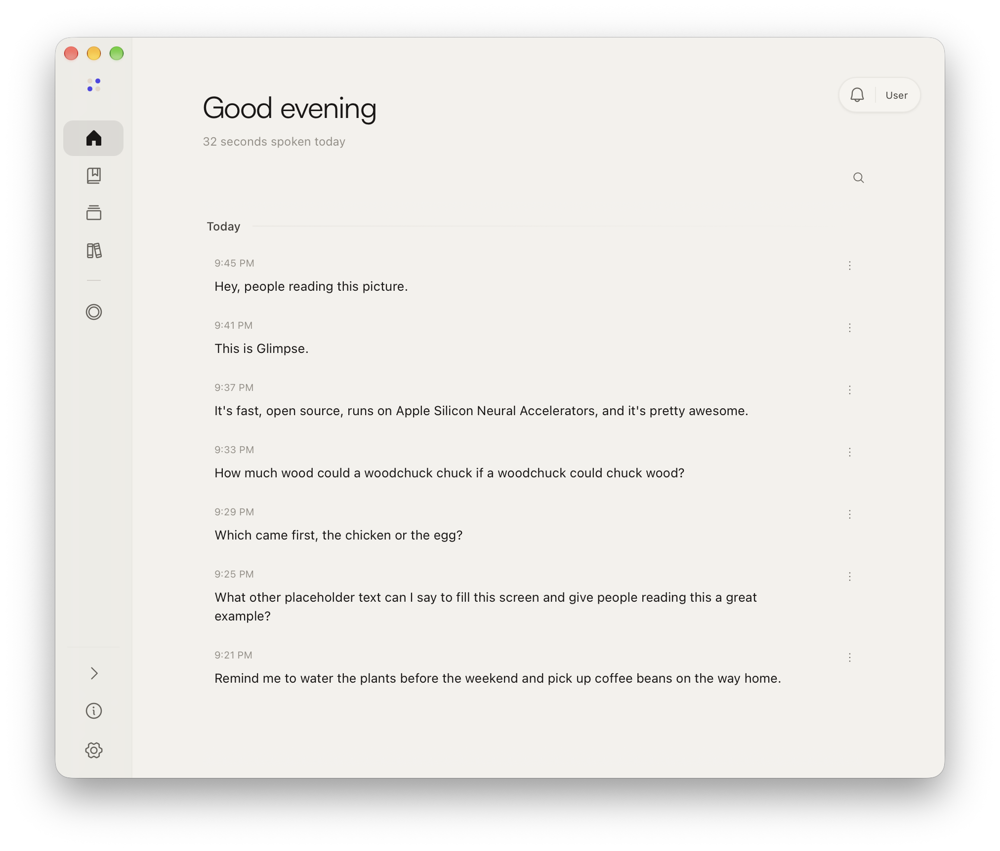
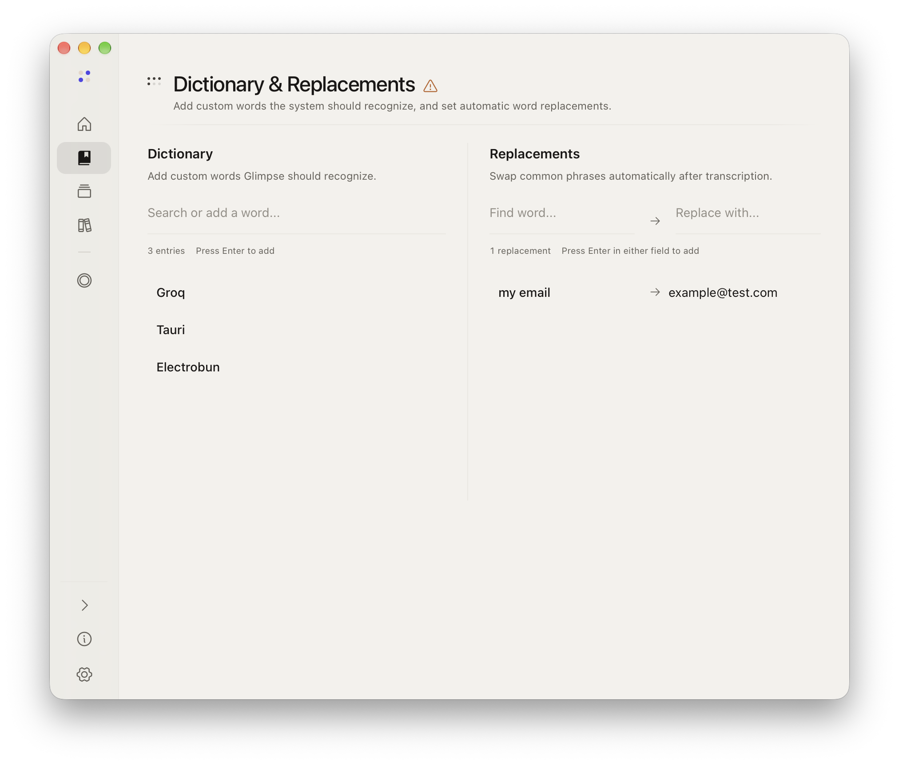
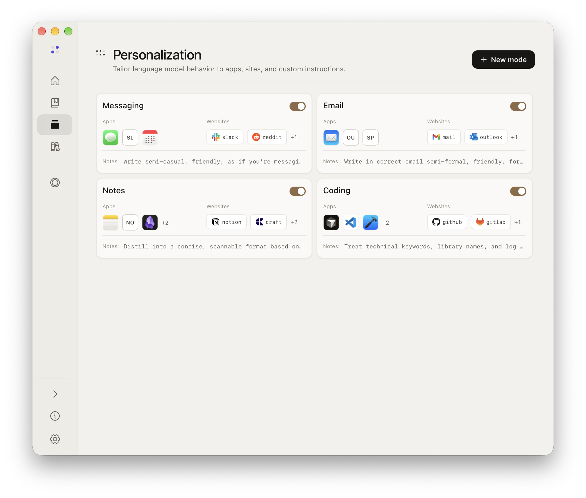
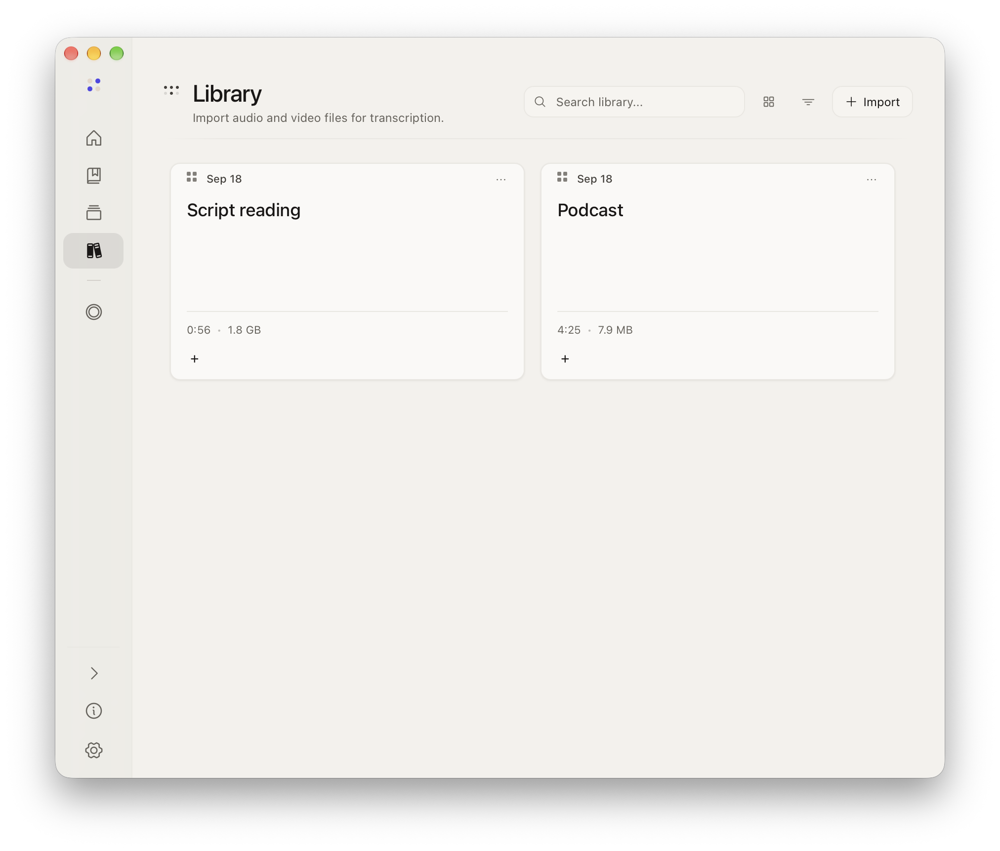

  <h1>Glimpse</h1>
  
On-device voice dictation. Open-source, private by default.

  
  

    <a href="https://tryglimpse.cc/download">Download</a> ·
    <a href="https://tryglimpse.cc/">Website</a> ·
    <a href="https://tryglimpse.cc/#pricing">Pricing</a> ·
    <a href="https://tryglimpse.cc/privacy">Privacy</a>
  

  

    
    
  

---

Core dictation is free, runs on-device, and has no word limits. A license adds everything else: AI features, media transcription, and automations.

## Screenshots

  
  

  
  

## Features

**Free, always**

- **Local transcription.** Turn your wifi off, it still works. ANE supported on Apple Silicon. Pick a model in **Settings → Models**.
- **Custom dictionary.** Teach it names, brands, or terms.
- **Auto Dictionary.** It picks up your custom words on its own.
- **Replacements.** Say "my address," get 221B Baker Street.
- **History and search.** Find anything you've dictated.

**With a license** (14-day trial included)

- **Library.** Drop in audio or video, scrub the synced transcript, assign speakers, export to `.txt`, `.md`, `.srt`, or `.vtt`.
- **AI Cleanup.** Polish dictated text with your own LLM, set up in **Settings → Providers**.
- **Edit Mode.** Highlight text, say what you want, and watch it rewrite in place.
- **Personalization.** Different tones per app or site, with [snippets](https://github.com/glimpse-hq/Glimpse/wiki/snippets) for dynamic context.

**License only** (not included in the trial)

- **Local API.** An OpenAI-compatible speech endpoint, running on your machine.
- **CLI.** An optional `glimpse` command for the terminal.

## Integrations

- **[Raycast](https://www.raycast.com/garon/glimpse)**. Search dictations, transcribe files, switch models, and more, without leaving Raycast. Requires a [license](#pricing).
- **Your own.** The [CLI guide](https://github.com/glimpse-hq/Glimpse/wiki/CLI) covers scripting Glimpse from Shortcuts, Finder, or anything else that can run a command.

## Pricing

| Edition        | Price             | For                                       |
| -------------- | ----------------- | ----------------------------------------- |
| **Personal**   | $24.99 one-time   | You, on up to 5 personal devices          |
| **Commercial** | $48 / seat / year | Work use, one seat per person, one device |

Start with the 14-day trial, then buy or paste a license key in **Settings → Account**.

## Privacy

Transcription stays on-device by default. Enabling an external speech or LLM provider sends audio or text directly to that provider. Your API keys stay local.

The app sends anonymous usage telemetry to [PostHog EU](https://posthog.com/) to help prioritize development. It's tied to a random install ID, not your identity, and stored in the EU.

- **Collected:** app version and platform, launches and uptime, whether the app quit normally, durations and counts, which built-in features you use, whether microphone and accessibility permissions are granted, your dictation and display language settings, a coarse hardware class (memory size range, chip family, graphics vendor), country, and bounded error/crash categories. A crash also records a code location (source file and line, or module and offset) so we can find the bug. If the app crashed, the next launch reads the crash report your OS saved and sends only the error type and module and offset frames.
- **Never sent:** transcripts, audio, API keys, prompts, raw error text or stacks, full file paths, microphone names, the apps you record, model or provider names you type in, provider endpoints, your IP address, or anything personally identifiable.

Opt out anytime in **Settings → App**. Opting out sends one final ping, then nothing, ever.

For the full picture, see the [analytics wiki](https://github.com/glimpse-hq/Glimpse/wiki/Analytics) or [`analytics/`](src-tauri/src/analytics). The website is a separate system with its own [privacy policy](https://tryglimpse.cc/privacy).

## Contributing

The [Contributing Guide](CONTRIBUTING.md) covers everything from translations to code to bug reports.

Questions, bugs, or feedback: [hello@tryglimpse.cc](mailto:hello@tryglimpse.cc) or [GitHub Issues](https://github.com/glimpse-hq/Glimpse/issues).

## Acknowledgments

-  [Lokalise](https://lokalise.com/), localization platform and OSS supporter
- [Tauri](https://v2.tauri.app/), app framework
- [Glimpse-Speech](https://github.com/glimpse-hq/Glimpse-Speech) (MIT), local transcription engine
- [whisper-rs](https://codeberg.org/tazz4843/whisper-rs) (Unlicense), Rust bindings for Whisper
- [parakeet-rs](https://github.com/altunenes/parakeet-rs) (MIT OR Apache-2.0), ONNX Runtime bindings for Parakeet

Speech models are downloaded in-app from Hugging Face. The live list lives in **Settings → Models**. By family:

- **Whisper GGML** (MIT), via [`ggerganov/whisper.cpp`](https://huggingface.co/ggerganov/whisper.cpp)
- **Distil-Whisper GGML** (MIT, English-only), via [Pomni's conversions](https://huggingface.co/Pomni) of [`distil-whisper`](https://huggingface.co/distil-whisper)
- **Parakeet TDT ONNX** (CC-BY-4.0), via [`istupakov`](https://huggingface.co/istupakov/parakeet-tdt-0.6b-v3-onnx)
- **Parakeet Unified ONNX** (CC-BY-4.0, English-only), via [`bobNight`](https://huggingface.co/bobNight/parakeet-unified-en-0.6b-onnx)
- **Nemotron Streaming ONNX** (NVIDIA Open Model License), via [`altunenes/parakeet-rs`](https://huggingface.co/altunenes/parakeet-rs)

## License

Glimpse is open source under the [GNU AGPL-3.0](LICENSE). In short:

- **Use it freely.** Run, study, modify, and redistribute it, including commercially.
- **Share your changes.** If you distribute a modified version, or run one as a network service, its source must be available under AGPL-3.0.
- **Keep the attribution.** Copyright and license notices stay intact, and a fork must state that it is based on Glimpse and link back to this repository.
- **Pick your own name.** The Glimpse name and logo are trademarks and not covered by the license. Forks and redistributions need a different name and icon.

The [full license text](LICENSE) and [NOTICE](NOTICE) are what apply; this summary is not a substitute for them.
